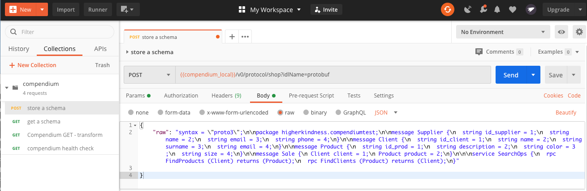

# COMPENDIUM EXAMPLE

This project contains some `sbt-compendium` examples.

## Before starting: requirements and configuration


- First you'll need a working `compendium server`, please check the 
[compendium documentation](https://higherkindness.io/compendium/docs/deployment/). 

    Compendium requires some PostgreSQL databases to save schemas, so two options are offered for set up all that.
    
    1. Use the [Docker image](https://higherkindness.io/compendium/docs/deployment/docker/) provided by Compenidum to 
    run a PostgreSQL database and a compendium instance connected to that database.
     
    2. Download [compendium project](https://github.com/higherkindness/compendium/) to have it locally. Install 
    PostgreSQL on your local, create the required databases (`compendium_metadata` and `compendium_protocols`) 
    and point compendium out to that PostgreSQL instance. All variables are defined at compendium’s `application.conf`.
    Once done that, you will be able to run the project and make your server work.
    

- Second, in order to add new schemas in our Compendium server, we'll have to make some http requests. We are going
to use [Postman](https://www.postman.com/) for this. Once installed, import collection provided on
`postman/compendium.postman_collection.json`. 


## [Proto] Model example

#####  **Warning:** Before compiling the project, make sure you have all the schemas in postgres.


### Example schema description

Let's suppose some data with the following structure:

| name | fields |
| ---- | ------ |
| supplier | id_supplier, name, email, phone |
| sale | client*, product** |
| client* | id_client, name, surname, email |
| product** | id_prod, description, color, size |
| material | name, code, shipId |

And this is the full schema: 


    syntax = "proto3";
    
    package higherkindness.compendiumtest;
    
    message Supplier {
      string id_supplier = 1;
      string name = 2;
      string email = 3;
      string phone = 4;
    }
    
    message Client {
      string id_client = 1;
      string name = 2;
      string surname = 3;
      string email = 4;
    }
    
    message Product {
      string id_prod = 1;
      string description = 2;
      string color = 3;
      string size = 4;
    }
    
    message Sale {
      Client client = 1;
      Product product = 2;
    }
    
    
    service SearchOps {
      rpc FindProducts (Client) returns (Product);
      rpc FindClients (Product) returns (Client);
    }


### Step 1: Upload your schemas to compendium

Open Postman. If you've imported the collection, you will have one POST request called _store a schema_

- The name of the protocol is given in the URL. In our case is `shop`, as you can see before the `?` adding the
request parameters.

- In _Params_ tab, change the value of the `idlName` key to `protobuf`

- Now in _Body_ tab, we are going to include the schema, that will be saved as a full string. To convert our schema 
into one escaped string with no offending characters that could make difficult the parsing, we can use tools like
[Json String Escape/Unescape](https://www.freeformatter.com/json-escape.html). 

- We will obtain this string, paste it after the `raw` property.

   ``` 
  "syntax = \"proto3\";\n\npackage higherkindness.compendiumtest;\n\nmessage Supplier {\n  string id_supplier = 1;
    \n  string name = 2;\n  string email = 3;\n  string phone = 4;\n}\n\nmessage Client {\n  string id_client = 1;\n  
    string name = 2;\n  string surname = 3;\n  string email = 4;\n}\n\nmessage Product {\n  string id_prod = 1;\n  
    string description = 2;\n  string color = 3;\n  string size = 4;\n}\n\nmessage Sale {\n Client client = 1;\n 
    Product product = 2;\n}\n\n\nservice SearchOps {\n  rpc FindProducts (Client) returns (Product);\n  
    rpc FindClients (Product) returns (Client);\n}" 
  ```

 

- Click the _Send_ button and the request it's done! If everything went well, you will obtain `1` as response.
This number is the version of the protocol that you have recently stored in postgres.  

### Step 2: Include the right configuration for the build 

 - Localize the `protoExample project in the file `build.sbt`. You will have to include these two _mandatory_ 
 dependencies for Protobuf type.
 
    ```
     "com.47deg" %% "pbdirect" % version.pbdirect 
     "io.higherkindness" %% "mu-rpc-service" % version.murpcservice
    ```
- You will find [here](https://higherkindness.io/mu-scala/guides/generate-sources-from-compendium) other settings 
related to compendium interaction that must be included in the the `build.sbt` in order to generate the sources
from the IDLs stored in compendium. 

### Step 3: Run the example 

To show this example run:

    sbt "project protoExample" run

- The log traces will show some data, which has been generated using [Mockaroo](https://mockaroo.com/).

- In `target/scala-2.12/src_managed` will appear scala files with all the case classes.

- You can also to generate the scala files without running the program. For that, just type:
     
    ```
    sbt "project protoExample" muSrcGen 
    ```

<br>
<br>
<br>

## [Avro] Model example

#####  **Warning:** Before compiling the project, make sure you have all the schemas in postgres.


### Example schema description

Let's suppose some data with the following structure:

| name | fields |
| ---- | ------ |
| supplier | id_supplier, name, email, phone |
| sale | client*, product** |
| client* | id_client, name, surname, email |
| product** | id_prod, description, color, size |
| material | name, code, shipId |


###Step 1: Upload your schemas to compendium


To show this example run:

    sbt "project avroExample" run

- The log traces will show some data.
- In `target/scala-2.12/src_managed` will appear scala files with all the case classes.
- On `plugin/src/main/resources` there are some csv files with data that correspond to its proper case class.


In postgres, schemas will be saved as a full string with the POST call:

| name | schema |
| ------- | ---------------------------------------- |
| supplier | ```  "{\"type\":\"record\",\"name\":\"Supplier\",\"namespace\":\"higherkindness.compendiumtest\",\"fields\":[{\"name\":\"id_supplier\",\"type\":\"string\"},{\"name\":\"name\",\"type\":\"string\"},{\"name\":\"email\",\"type\":\"string\"},{\"name\":\"phone\",\"type\":\"string\"}]}"``` |
| sale | ``` "{\"type\":\"record\",\"name\":\"Sale\",\"namespace\":\"higherkindness.compendiumtest\",\"fields\":[{\"name\":\"client\",\"type\":{\"type\":\"record\",\"name\":\"Client\",\"fields\":[{\"name\":\"id_client\",\"type\":\"string\"},{\"name\":\"name\",\"type\":\"string\"},{\"name\":\"surname\",\"type\":\"string\"},{\"name\":\"email\",\"type\":\"string\"}]}},{\"name\":\"product\",\"type\":{\"type\":\"record\",\"name\":\"Product\",\"fields\":[{\"name\":\"id_prod\",\"type\":\"string\"},{\"name\":\"description\",\"type\":\"string\"},{\"name\":\"color\",\"type\":\"string\"},{\"name\":\"size\",\"type\":\"string\"}]}}]}" ```|
| client* | Generated by the nested schema in `sale` |
| product** | Generated by the nested schema in `sale` |
| material | ``` "{\"type\":\"record\",\"name\":\"Material\",\"namespace\":\"higherkindness.compendiumtest\",\"fields\":[{\"name\":\"name\",\"type\":\"string\"},{\"name\":\"code\",\"type\":\"string\"},{\"name\":\"shipId\",\"type\":\"string\"}]}"  ``` |

- Schemas have been flatted using [From json to string Converter](https://tools.knowledgewalls.com/jsontostring)


Please, notice that in POST calls the identifiers need to be added to the `compendiumProtocolIdentifiers` list in the `build.sbt` file.


### Avro files in JSON format

This section provides, in json format, the schemas presented previously. Also it contains new models and versions to test the behaviour of `compendium`.
Remember, compendium always provides the last version saved unless otherwise stated.

##### Supplier schema:

     {
      "type": "record",
      "name": "Supplier",
      "namespace": "higherkindness.compendiumtest",
      "fields": [
        {
            "name": "id_supplier",
            "type": "string"
        }, 
        {
            "name": "name",
            "type": "string"
        },
        {
            "name": "email",
            "type": "string"
        },
        {
            "name": "phone",
            "type": "string"
        }
      ]
    }

##### Sale schema:

    {
      "type": "record",
      "name": "Sale",
      "namespace": "higherkindness.compendiumtest",
      "fields": [
        {
            "name": "client",
            "type": "higherkindness.compendiumtest.Client"
        },
        {
            "name": "product",
            "type": "higherkindness.compendiumtest.Product"
        }
      ]
    }

##### Client schema [used in nested supplier schema]:

    {
      "type": "record",
      "name": "Client",
      "namespace": "higherkindness.compendiumtest",
      "fields": [
        {
            "name": "id_client",
            "type": "string"
        },  
        {
            "name": "name",
            "type": "string"
        },
        {
            "name": "surname",
            "type": "string"
        },
        {
            "name": "email",
            "type": "string"
        }
      ]
    }


##### Product schema [used in nested Supplier schema]:

    {
      "type": "record",
      "name": "Product",
      "namespace": "higherkindness.compendiumtest",
      "fields": [
        {
            "name": "id_prod",
            "type": "string"
        },
        {
            "name": "description",
            "type": "string"
        },    
        {
            "name": "color",
            "type": "string"
        },
        {
            "name": "size",
            "type": "string"
        }
      ]
    }

##### Material schema (first version):

    {
      "type": "record",
      "name": "Material",
      "namespace": "higherkindness.compendiumtest",
      "fields": [
        {
            "name": "name",
            "type": "string"
        },
        {
            "name": "code",
            "type": "string"
        },
        {
            "name": "shipId",
            "type": "string"
        }
      ]
    }


#### Future iterations

You can add a new version of each schema adding new fields.

##### Product schema (second version):

    {
      "type": "record",
      "name": "Product",
      "namespace": "higherkindness.compendiumtest",
      "fields": [
         {
            "name": "id_prod",
            "type": "string"
        },
        {
            "name": "name",
            "type": "string"
        },
        {
            "name": "color",
            "type": "string"
        },
        {
            "name": "size",
            "type": "string"
        },
        {
            "name": "soldDate",
            "type": "string"
        }
      ]
    }


##### Material schema (second version):

    {
      "type": "record",
      "name": "Material",
      "namespace": "higherkindness.compendiumtest",
      "fields": [
        {
            "name": "name",
            "type": "string"
        },
        {
            "name": "code",
            "type": "string"
        },
        {
            "name": "originIdentifier",
            "type": "higherkindness.compendiumtest.Supplier"
        },    
        {
            "name": "shipId",
            "type": "string"
        },    
        {
            "name": "color",
            "type": "string"
        }
      ]
    }

##### Process version:

    {
      "type": "record",
      "name": "Process",
      "namespace": "higherkindness.compendiumtest",
      "fields": [
        {
            "name": "name",
            "type": "string"
        },
        {
            "name": "mat",
            "type": {
                "type": "array",
                "items": "higherkindness.compendiumtest.Material"
            }
        },
        {
            "name": "prod",
            "type": "higherkindness.compendiumtest.Product"
        }
      ]
    }

